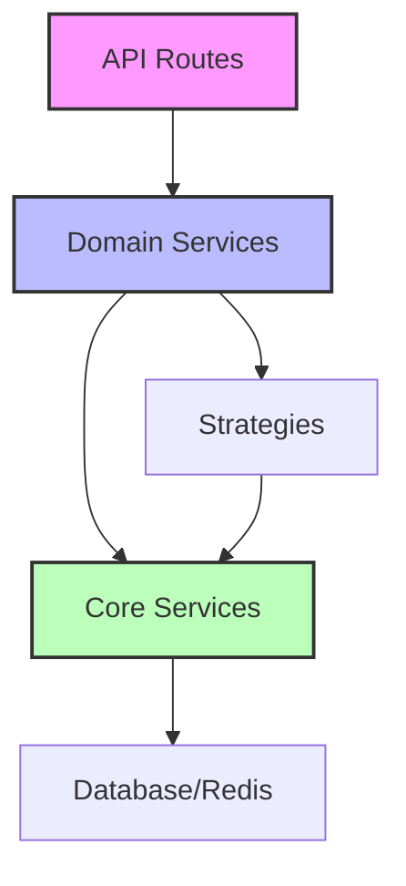

# Service Layer Refactoring Implementation Plan

## Current Problems
1. **4 Overlapping Services** doing card enrichment:
   - `AutoEnrichingSalesService.ts` (406 lines)
   - `CardEnrichmentService.ts` (13KB) 
   - `OptimizedSalesEnrichment.ts` (8.6KB)
   - `SalesService.ts` (3.8KB)
   - `CardEnrichmentEngine.ts` (331 lines)

2. **Duplicate Code**:
   - Collection-to-set mapping in 3 places
   - Database lookup methods repeated
   - Similar enrichment logic patterns

3. **Unclear Boundaries**:
   - Which service to use when?
   - Overlapping responsibilities
   - No clear domain separation

## Proposed Architecture

```
┌─────────────────────────────────────────────────────┐
│                  Application Layer                   │
├─────────────────────────────────────────────────────┤
│                   Service Layer                      │
│  ┌─────────────────────────────────────────────┐   │
│  │          Core Services (Singleton)          │   │
│  │  • CardDataService (DB operations)          │   │
│  │  • CardSyncService (API sync)               │   │
│  │  • CacheService (Redis operations)          │   │
│  └─────────────────────────────────────────────┘   │
│  ┌─────────────────────────────────────────────┐   │
│  │         Domain Services (Business)          │   │
│  │  • SalesEnrichmentService                   │   │
│  │  • TradeAnalysisService                     │   │
│  │  • CollectionManagementService              │   │
│  │  • PreloadOrchestrationService              │   │
│  └─────────────────────────────────────────────┘   │
├─────────────────────────────────────────────────────┤
│                   Data Layer                         │
│  • Prisma Client                                     │
│  • Redis Client                                      │
│  • External APIs (Alchemy, rip.fun)                 │
└─────────────────────────────────────────────────────┘
```

## Phase 1: Core Service Extraction (Day 1-2)

### 1.1 Create `CardDataService` (Database Operations)
**Location**: `/src/lib/server/services/core/CardDataService.ts`

```typescript
export class CardDataService {
  // Single source of truth for card database operations
  
  async findCardById(id: string): Promise<Card | null>
  async findCardByName(name: string, setId?: string): Promise<Card | null>
  async findCardsBySet(setId: string): Promise<Card[]>
  async checkSetAvailability(setId: string): Promise<boolean>
  async saveCards(cards: Card[]): Promise<number>
  
  // Centralized collection mappings
  private readonly COLLECTION_MAPPINGS = {
    // Single source of truth for all mappings
  }
}
```

### 1.2 Extract `CardEnrichmentStrategy` (Strategy Pattern)
**Location**: `/src/lib/server/services/strategies/`

```typescript
// Base strategy interface
interface EnrichmentStrategy {
  canEnrich(metadata: any): boolean;
  enrich(metadata: any): Promise<EnrichedData>;
  priority: number;
}

// Concrete strategies
class DatabaseEnrichmentStrategy implements EnrichmentStrategy { }
class OnchainEnrichmentStrategy implements EnrichmentStrategy { }
class ReconciliationEnrichmentStrategy implements EnrichmentStrategy { }
class FallbackEnrichmentStrategy implements EnrichmentStrategy { }
```

### 1.3 Create `CacheService` (Centralized Caching)
**Location**: `/src/lib/server/services/core/CacheService.ts`

```typescript
export class CacheService {
  // All Redis operations in one place
  
  async cacheCard(card: Card): Promise<void>
  async getCachedCard(id: string): Promise<Card | null>
  async cacheSetData(setId: string, cards: Card[]): Promise<void>
  async getCachedSetData(setId: string): Promise<Card[] | null>
  async invalidateCache(pattern: string): Promise<void>
}
```

## Phase 2: Domain Service Consolidation (Day 3-4)

### 2.1 Unified `SalesEnrichmentService`
**Location**: `/src/lib/server/services/domain/SalesEnrichmentService.ts`

```typescript
export class SalesEnrichmentService {
  constructor(
    private cardDataService: CardDataService,
    private cacheService: CacheService,
    private strategies: EnrichmentStrategy[]
  ) {}
  
  async enrichSalesEvent(event: SalesEvent): Promise<EnrichedSalesEvent> {
    // Use strategy pattern to try enrichment methods in priority order
    for (const strategy of this.strategies.sort((a, b) => b.priority - a.priority)) {
      if (strategy.canEnrich(event)) {
        const enriched = await strategy.enrich(event);
        if (enriched) return enriched;
      }
    }
    return this.fallbackEnrichment(event);
  }
}
```

### 2.2 Extract `PreloadOrchestrationService`
**Location**: `/src/lib/server/services/domain/PreloadOrchestrationService.ts`

```typescript
export class PreloadOrchestrationService {
  // Handles all preloading logic
  
  private readonly PRIORITY_SETS = [
    { setId: 'sv3pt5', priority: 10, reason: 'most_popular' },
    { setId: 'sv4pt5', priority: 9, reason: 'high_volume' },
    // ... organized priority list
  ];
  
  async preloadPopularSets(): Promise<PreloadResult>
  async preloadSet(setId: string): Promise<number>
  async getPreloadStatus(): Promise<PreloadStatus>
  async schedulePreload(schedule: CronExpression): void
}
```

## Phase 3: Migration & Cleanup (Day 5-6)

### 3.1 Migration Steps
1. **Create new services** without breaking existing code
2. **Add deprecation warnings** to old services
3. **Migrate endpoints** one by one:
   - `/api/sales/live` → Use new `SalesEnrichmentService`
   - `/api/cards/preload` → Use new `PreloadOrchestrationService`
   - `/api/trade-compare` → Keep using `TradeAnalyzer` (already clean)

### 3.2 Update Import Paths
```typescript
// OLD
import { autoEnrichingSalesService } from '$lib/services/AutoEnrichingSalesService';

// NEW  
import { salesEnrichmentService } from '$lib/server/services/domain/SalesEnrichmentService';
```

### 3.3 Delete Old Services (After Testing)
- Remove `AutoEnrichingSalesService.ts`
- Remove `OptimizedSalesEnrichment.ts`
- Remove `CardEnrichmentService.ts` (client-side)
- Keep `CardEnrichmentEngine.ts` but refactor as strategy

## Phase 4: Testing & Documentation (Day 7)

### 4.1 Add Unit Tests
```typescript
// tests/services/core/CardDataService.test.ts
describe('CardDataService', () => {
  test('findCardById returns correct card', async () => {})
  test('checkSetAvailability handles missing sets', async () => {})
})

// tests/services/domain/SalesEnrichmentService.test.ts
describe('SalesEnrichmentService', () => {
  test('enriches with database data when available', async () => {})
  test('falls back to onchain data when DB empty', async () => {})
  test('downloads missing sets automatically', async () => {})
})
```

### 4.2 Add Service Documentation
```typescript
/**
 * SalesEnrichmentService
 * 
 * Primary service for enriching sales events with card metadata.
 * Uses a strategy pattern to try multiple enrichment sources in priority order.
 * 
 * @example
 * const enriched = await salesEnrichmentService.enrichSalesEvent(event);
 * 
 * @see CardDataService for database operations
 * @see EnrichmentStrategy for available strategies
 */
```

## Implementation Checklist

### Week 1 Tasks
- [ ] Create `/src/lib/server/services/core/` directory
- [ ] Implement `CardDataService` with all DB operations
- [ ] Extract collection mappings to single location
- [ ] Create `CacheService` for Redis operations
- [ ] Design `EnrichmentStrategy` interface
- [ ] Implement concrete strategy classes

### Week 2 Tasks  
- [ ] Create `/src/lib/server/services/domain/` directory
- [ ] Build unified `SalesEnrichmentService`
- [ ] Extract `PreloadOrchestrationService`
- [ ] Add dependency injection container
- [ ] Migrate first endpoint as proof of concept
- [ ] Add comprehensive logging

### Testing & Rollout
- [ ] Write unit tests for core services
- [ ] Write integration tests for domain services
- [ ] Add performance benchmarks
- [ ] Create migration guide
- [ ] Update API documentation
- [ ] Deploy to staging environment
- [ ] Monitor for 48 hours
- [ ] Roll out to production
- [ ] Remove deprecated services

## Success Metrics
- **Code Reduction**: Target 40% less code through deduplication
- **Performance**: <100ms average enrichment time
- **Cache Hit Rate**: >80% for popular cards
- **Test Coverage**: >90% for core services
- **API Response Time**: No degradation from current

## Risk Mitigation
1. **Parallel Run**: Keep old services during migration
2. **Feature Flags**: Toggle between old/new services
3. **Rollback Plan**: Git tags at each phase completion
4. **Monitoring**: Add metrics for service performance
5. **Gradual Migration**: One endpoint at a time

## File Structure After Refactoring

```
src/lib/server/services/
├── core/                    # Infrastructure services
│   ├── CardDataService.ts   # Database operations
│   ├── CacheService.ts      # Redis operations
│   └── index.ts            
├── domain/                   # Business logic services
│   ├── SalesEnrichmentService.ts
│   ├── PreloadOrchestrationService.ts
│   ├── CollectionManagementService.ts
│   └── index.ts
├── strategies/              # Enrichment strategies
│   ├── DatabaseEnrichmentStrategy.ts
│   ├── OnchainEnrichmentStrategy.ts
│   ├── ReconciliationStrategy.ts
│   └── index.ts
├── types/                   # Shared types
│   ├── enrichment.ts
│   ├── sales.ts
│   └── index.ts
└── index.ts                # Main export file
```

## Dependencies Map



## Notes for Implementation

1. **Start Small**: Begin with `CardDataService` as it's the foundation
2. **Maintain Backwards Compatibility**: Use adapter pattern during migration
3. **Document Everything**: Each service should have clear responsibilities
4. **Use TypeScript Strictly**: Leverage types for safety during refactor
5. **Performance First**: Add caching at every appropriate layer

This refactoring will transform the chaotic service layer into a clean, maintainable architecture with clear boundaries and single responsibilities.
